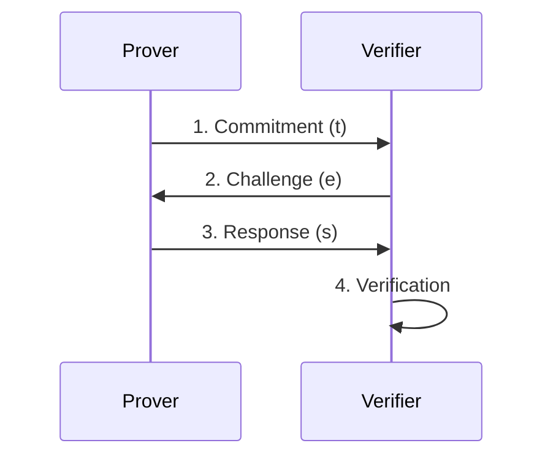

<div align="center">

# 🔐 Zero-Knowledge Proof Concepts

### Interactive Educational Platform

<p align="center">
  
  
  
  
</p>

<p align="center">
  <strong>Prove knowledge without revealing secrets</strong><br>
  A comprehensive educational platform demonstrating Zero-Knowledge Proof concepts through interactive web-based implementations
</p>

[Live Demo](#) • [Documentation](#-how-it-works) • [Getting Started](#-installation--setup) • [Contributing](#-contributing)

</div>

---

## 🎯 Overview

> **Zero-Knowledge Proofs** enable privacy-preserving verification where a prover can demonstrate knowledge of secrets or satisfy conditions without revealing the underlying information.

<table>
<tr>
<td width="50%">

### 🔑 What You'll Learn

- **Password Authentication**  
  Prove password knowledge without transmission
- **Age Verification**  
  Prove age requirements without revealing exact age
- **Range Proofs**  
  Prove values fall within ranges without disclosure
- **Membership Proofs**  
  Prove group membership without revealing identity

</td>
<td width="50%">

### 🛠️ Technology Stack

- **Protocol**: Schnorr Identification
- **Cryptography**: Discrete Logarithm Problem
- **Hash Function**: SHA-256
- **Backend**: Python + Flask
- **Frontend**: Modern HTML5 + CSS3
- **Deployment**: Vercel Serverless

</td>
</tr>
</table>

## ✨ Features

<details open>
<summary><b>🔐 Multiple ZKP Demonstrations</b></summary>
<br>

| Feature                        | Description                                                                 |
| ------------------------------ | --------------------------------------------------------------------------- |
| 🔑 **Password Authentication** | Schnorr protocol for secure login without password transmission             |
| 🎂 **Age Verification**        | Range proofs for proving age requirements (18+) without revealing exact age |
| 📊 **Range Proofs**            | Demonstrate values within specified ranges without disclosure               |
| 👥 **Membership Proofs**       | Prove group membership without revealing specific identity                  |

</details>

<details open>
<summary><b>🎨 Interactive Learning Platform</b></summary>
<br>

```
✓ Beautiful Modern UI with gradient-based interface and smooth animations
✓ Step-by-Step Visualization of cryptographic protocol execution
✓ Educational Theory Section explaining completeness, soundness, and zero-knowledge
✓ Multi-Round Verification with configurable rounds for enhanced security
```

</details>

<details open>
<summary><b>🚀 Technical Excellence</b></summary>
<br>

- ✅ **Production Ready** - Deployed on Vercel with serverless architecture
- ✅ **Responsive Design** - Works seamlessly across all devices and screen sizes
- ✅ **Cryptographically Sound** - Based on discrete logarithm problem in finite fields
- ✅ **Educational Focus** - Clear explanations of mathematical foundations

</details>

## 🏗️ Architecture

<table>
<tr>
<td>

### 🔢 Mathematical Foundation

| Component         | Value                  |
| ----------------- | ---------------------- |
| **Prime Field**   | Z_p where p = 10007    |
| **Generator**     | g = 5 (primitive root) |
| **Hash Function** | SHA-256                |
| **Protocol**      | Schnorr identification |

</td>
<td>

### 🔄 Protocol Flow



</td>
</tr>
</table>

### 📦 System Components

```
┌─────────────────────────────────────────────────────────────┐
│                    ZKP Concept Demonstrations                │
├─────────────────┬─────────────────┬─────────────────────────┤
│   Password      │  Age Verify     │    Range Proof          │
│ Authentication  │   (18+ check)   │  (Value in [a,b])       │
├─────────────────┼─────────────────┼─────────────────────────┤
│  Membership     │   Mathematical  │   Interactive UI        │
│    Proof        │   Foundation    │   & Visualization       │
│ (Group member)  │ (Schnorr + DLP) │  (Step-by-step)         │
└─────────────────┴─────────────────┴─────────────────────────┘
```

---

### 🧪 Test Credentials & Scenarios

> 💡 **Tip**: Try wrong values first to see how the system detects invalid proofs!

| Demo Type         | Test Value                   | Expected Result           |
| ----------------- | ---------------------------- | ------------------------- |
| 🔑 **Password**   | `SecurePassword123`          | ✅ Authentication Success |
| 🎂 **Age**        | Birth year `2000` or earlier | ✅ Age Verified (18+)     |
| 📊 **Range**      | Number `3500`                | ✅ In Range [1000-5000]   |
| 👥 **Membership** | `Charlie`                    | ✅ Valid Group Member     |

<sup>Valid group members: Alice, Bob, Charlie, Diana, Eve</sup>

## 📋 Prerequisites

<div align="center">

| Requirement | Version                          |
| ----------- | -------------------------------- |
| 🐍 Python   | 3.7+                             |
| 🌶️ Flask    | 2.3.3                            |
| 🌐 Browser  | Modern (Chrome, Firefox, Safari) |
| 📦 Git      | Latest                           |

</div>

## 🚀 Installation & Setup

### 💻 Local Development

<details>
<summary><b>Click to expand setup instructions</b></summary>

#### Step 1: Clone the repository

```bash
git clone https://github.com/AtharvaLotankar11/Zero-Knowledge-Proofs_CNS.git
cd Zero-Knowledge-Proofs_CNS
```

#### Step 2: Install dependencies

```bash
pip install -r requirements.txt
```

#### Step 3: Set up environment variables

```bash
cp .env.example .env
# Edit .env file with your secret key
```

#### Step 4: Run the application

```bash
python app.py
```

#### Step 5: Access the demo

```
🌐 http://localhost:5000
```

</details>

### ☁️ Vercel Deployment

<details>
<summary><b>Deploy to Vercel in 3 steps</b></summary>

#### 1️⃣ Fork/Clone this repository

#### 2️⃣ Connect to Vercel

- Visit [vercel.com](https://vercel.com)
- Import your GitHub repository
- Deploy automatically ✨

#### 3️⃣ Configuration

```yaml
Framework: Other
Build Command: (leave empty)
Output Directory: (leave empty)
Install Command: pip install -r requirements.txt
```

</details>

## 📁 Project Structure

```
Zero-Knowledge-Proofs_CNS/
│
├── 📂 api/
│   └── 📄 index.py              # Vercel serverless function
│
├── 📂 templates/
│   └── 📄 index.html            # Frontend interface
│
├── 📄 app.py                    # Local Flask application
├── 📄 main.py                   # CLI demonstration
├── 📄 requirements.txt          # Python dependencies
├── 📄 vercel.json              # Vercel configuration
├── 📄 ZKP_CONCEPTS.md          # Detailed ZKP concepts
└── 📄 README.md                # Project documentation
```

## 🔬 How It Works

### 1️⃣ Core ZKP Concepts Demonstrated

<details>
<summary><b>🔑 Password Authentication (Schnorr Protocol)</b></summary>

```python
Prover Secret: x = H(password) mod q
Public Key: y = g^x mod p

For each round:
1. Prover → Verifier: t = g^k mod p (commitment)
2. Verifier → Prover: e (random challenge)
3. Prover → Verifier: s = k + ex mod q (response)
4. Verifier checks: g^s ≟ t × y^e mod p
```

</details>

<details>
<summary><b>🎂 Age Verification (Range Proof Simplified)</b></summary>

```python
Proves: age ≥ min_age without revealing exact age
Secret: age_proof = actual_age - min_age
Uses commitment scheme to hide exact age while proving minimum requirement
```

</details>

<details>
<summary><b>📊 Range Proof</b></summary>

```python
Proves: value ∈ [min, max] without revealing value
Normalizes secret to [0, max-min] range
Uses commitment and challenge-response to verify range membership
```

</details>

<details>
<summary><b>👥 Membership Proof</b></summary>

```python
Proves: identity ∈ group without revealing which member
Maps member to index, uses index as secret
Verifies group membership without identity disclosure
```

</details>

---

### 2️⃣ Security Properties

<table>
<tr>
<td align="center" width="33%">

### ✅ Completeness

Honest prover always convinces honest verifier

</td>
<td align="center" width="33%">

### 🛡️ Soundness

Cheating probability ≤ 1/2^rounds  
(default: 1/8 for 3 rounds)

</td>
<td align="center" width="33%">

### 🔒 Zero-Knowledge

Verifier learns only the proven fact, nothing more

</td>
</tr>
</table>

---

### 3️⃣ Implementation Details

| Component                      | Description                                                        |
| ------------------------------ | ------------------------------------------------------------------ |
| 🔢 **Mathematical Foundation** | Discrete logarithm problem in finite field Z_p                     |
| 🔐 **Hash Functions**          | SHA-256 for deterministic secret generation                        |
| 📝 **Commitment Schemes**      | Pedersen-style commitments using modular exponentiation            |
| 🔄 **Multi-Round Protocol**    | 3 rounds by default for demonstration clarity                      |
| 🎯 **Finite Field**            | Prime p=10007 (educational size; production uses 2048+ bit primes) |

## 🎮 Usage Examples

### 🌐 Web Interface - Multiple Demos

<table>
<tr>
<td width="50%">

#### 🔑 Password Authentication

1. Enter password: `SecurePassword123`
2. Click "Authenticate with ZKP"
3. Watch Schnorr protocol execution

#### 📊 Range Proof

1. Enter number: `3500`
2. Click "Prove Range with ZKP"
3. Verify number is in [1000, 5000]

</td>
<td width="50%">

#### 🎂 Age Verification

1. Enter birth year: `2000` (or earlier)
2. Click "Verify Age with ZKP"
3. See age range proof without revealing exact age

#### 👥 Membership Proof

1. Select member: `Charlie`
2. Click "Prove Membership with ZKP"
3. Verify group membership without revealing identity

</td>
</tr>
</table>

---

### 💻 Command Line Interface

```bash
python main.py
# Interactive password authentication demo
# Enter password when prompted
# Observe the mathematical proof process
```

---

### 🔌 API Endpoints

<details>
<summary><b>View API Examples</b></summary>

#### 🔑 Password Authentication

```bash
curl -X POST http://localhost:5000/zkp/password \
  -H "Content-Type: application/json" \
  -d '{"password": "SecurePassword123"}'
```

#### 🎂 Age Verification

```bash
curl -X POST http://localhost:5000/zkp/age \
  -H "Content-Type: application/json" \
  -d '{"birth_year": 2000}'
```

#### 📊 Range Proof

```bash
curl -X POST http://localhost:5000/zkp/range \
  -H "Content-Type: application/json" \
  -d '{"number": 3500}'
```

#### 👥 Membership Proof

```bash
curl -X POST http://localhost:5000/zkp/membership \
  -H "Content-Type: application/json" \
  -d '{"member": "Charlie"}'
```

</details>

## 🔧 Configuration

<table>
<tr>
<td width="50%">

### 🔐 Security Parameters

```python
p = 10007        # Prime modulus
                 # (use 2048-bit in production)
g = 5           # Generator
rounds = 3      # Verification rounds
```

</td>
<td width="50%">

### 🌍 Environment Variables

```bash
SECRET_KEY=your-flask-secret-key
# For session management
```

</td>
</tr>
</table>

## 🧪 Testing

### ✅ Test Cases

<details>
<summary><b>🔑 Password Authentication</b></summary>

| Test Case             | Input               | Expected Result      |
| --------------------- | ------------------- | -------------------- |
| ✅ Correct Password   | `SecurePassword123` | Pass all rounds      |
| ❌ Incorrect Password | Any other value     | Fail verification    |
| ⚠️ Empty Password     | Empty string        | Return error message |

</details>

<details>
<summary><b>🎂 Age Verification</b></summary>

| Test Case        | Input             | Expected Result                   |
| ---------------- | ----------------- | --------------------------------- |
| ✅ Valid Age     | Birth year ≤ 2006 | Pass verification                 |
| ❌ Invalid Age   | Birth year > 2006 | Fail with age requirement message |
| ⚠️ Invalid Input | Non-numeric       | Handle gracefully                 |

</details>

<details>
<summary><b>📊 Range Proof</b></summary>

| Test Case         | Input              | Expected Result           |
| ----------------- | ------------------ | ------------------------- |
| ✅ Correct Number | `3500`             | Pass range verification   |
| ❌ Out of Range   | < 1000 or > 5000   | Fail with range violation |
| ❌ Wrong Number   | In range but wrong | Fail authentication       |

</details>

<details>
<summary><b>👥 Membership Proof</b></summary>

| Test Case          | Input     | Expected Result              |
| ------------------ | --------- | ---------------------------- |
| ✅ Valid Member    | `Charlie` | Pass membership verification |
| ❌ Invalid Member  | `Frank`   | Fail with membership error   |
| ⚠️ Empty Selection | Empty     | Return validation error      |

</details>

---

### 🔒 Security Testing Checklist

- ✅ Verify cheating detection across all proof types
- ✅ Test with edge cases and boundary values
- ✅ Confirm fresh randomness in each protocol round
- ✅ Validate mathematical correctness of verification equations

## 🤝 Contributing

<div align="center">

### We welcome contributions! 🎉

</div>

<table>
<tr>
<td width="50%">

### 📝 How to Contribute

1. 🍴 Fork the repository
2. 🌿 Create a feature branch
   ```bash
   git checkout -b feature/amazing-feature
   ```
3. 💾 Commit your changes
   ```bash
   git commit -m 'Add amazing feature'
   ```
4. 📤 Push to the branch
   ```bash
   git push origin feature/amazing-feature
   ```
5. 🔀 Open a Pull Request

</td>
<td width="50%">

### 📋 Development Guidelines

- ✅ Follow PEP 8 for Python code
- ✅ Add comments for complex math operations
- ✅ Test with valid and invalid inputs
- ✅ Update documentation for new features
- ✅ Ensure backward compatibility
- ✅ Write clear commit messages

</td>
</tr>
</table>

## 📚 Educational Resources

<table>
<tr>
<td width="50%">

### 🎓 Zero-Knowledge Proofs

- 📖 [Introduction to Zero-Knowledge Proofs](https://blog.cryptographyengineering.com/2014/11/27/zero-knowledge-proofs-illustrated-primer/)
- 🔐 [Schnorr Identification Protocol](https://en.wikipedia.org/wiki/Proof_of_knowledge#Schnorr_protocol)
- 📚 [Modern Cryptography Textbook](https://toc.cryptobook.us/)

</td>
<td width="50%">

### 🔧 Implementation References

- 🔢 [Discrete Logarithm Problem](https://en.wikipedia.org/wiki/Discrete_logarithm)
- ➗ [Modular Arithmetic](https://en.wikipedia.org/wiki/Modular_arithmetic)
- 🔐 [Cryptographic Hash Functions](https://en.wikipedia.org/wiki/Cryptographic_hash_function)

</td>
</tr>
</table>

## 🛡️ Security Considerations

<table>
<tr>
<td width="50%">

### 🚀 Production Deployment

- ✅ Use 2048-bit primes for real-world applications
- ✅ Implement proper session management
- ✅ Add rate limiting for authentication attempts
- ✅ Use HTTPS for all communications
- ✅ Consider timing attack mitigations

</td>
<td width="50%">

### ⚠️ Known Limitations

- 📝 Demo uses small prime (10007) for educational purposes
- 💾 No persistent user storage
- 🔑 Single hardcoded password for demonstration
- 🌐 Client-side JavaScript handles sensitive operations

</td>
</tr>
</table>

---

## 👥 Authors

<div align="center">

<table>
<tr>
<td align="center" width="50%">

<br>
<sub><b>Roll No: 27</b></sub>
</td>
<td align="center" width="50%">

<br>
<sub><b>Roll No: 41</b></sub>
</td>
</tr>
</table>

</div>

---

<div align="center">

### ⭐ Star this repository if you found it helpful!

<p>


</p>

**Built with ❤️ for educational purposes and practical cryptography learning**

<sub>© 2024 Zero-Knowledge Proof Concepts. All rights reserved.</sub>

</div>
